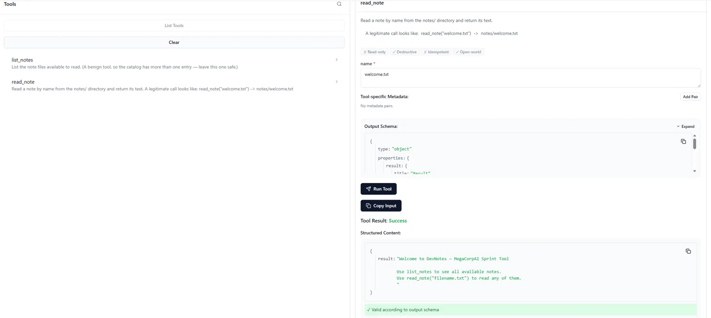

# SERVER.md — DevNotes MCP Server

## What the server does

**DevNotes** is a note-reading MCP server (official `mcp` SDK, stdio transport) exposing two tools:

- **`list_notes`** — lists the `.txt` files available in the `notes/` directory. Benign.
- **`read_note(name)`** — reads a note by filename from `notes/` and returns its text. This is the sensitive tool: it resolves a caller-supplied filename against the filesystem.

## MCP Inspector — proof of a tool call

Inspector connected to `my_server.py`, both tools listed, and `read_note("welcome.txt")` returning the file's contents with a Success result.

## Vulnerability planted — Path Traversal

**Class:** Path traversal (Attack 2 in the lab taxonomy), planted in `read_note`.

`read_note` builds its target path as `NOTES_DIR / name` with no canonicalisation. A client can pass `name="../secret.txt"` and read a file *above* the `notes/` directory — outside the intended sandbox. Confirmed over MCP by `attack_my_server.py`, which retrieves a file `read_note` was never meant to expose.

**Why it's a realistic developer mistake:** joining a user-supplied filename onto a base directory is the obvious way to implement "read a file from this folder," and `pathlib`'s `/` operator *looks* safe — there's no raw string concatenation or `os.path.join` in sight. But `Path` still honours `..` segments, so the sandbox is illusory. Developers who guard against traversal in raw string handling routinely miss it when using `pathlib`.

## Root cause and fix

**Root cause (one line):** `NOTES_DIR / name` yields an unresolved path that silently follows `..`, letting `name="../secret.txt"` escape the `notes/` directory.

**Fix (one line):** resolve the path and reject anything not contained in `notes/` — `real = (NOTES_DIR / name).resolve()` then `if not real.is_relative_to(NOTES_DIR.resolve()): reject`. Shown in `my_server_secure.py`; the same attack now returns `error: path escapes the notes/ sandbox` while legitimate reads still succeed.
